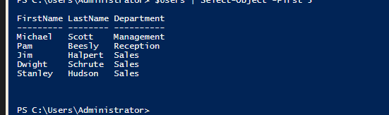

# Enterprise Network & Active Directory Security Lab

## Project Overview
A fully virtualized corporate network environment designed to simulate real-world identity management and network security operations. This lab integrates **Windows Server 2022 (Active Directory)** with **Linux (Ubuntu)** clients and enforces network segmentation using a **pfSense** firewall.

**Goal:** To engineer a secure, cross-platform infrastructure adhering to Least Privilege and Defense-in-Depth principles, utilizing **PowerShell automation** for scalable identity lifecycle management.

---

## Architecture & Topology
* **Hypervisor:** VirtualBox
* **Firewall/Router:** pfSense (WAN/LAN Separation)
* **Domain Controller:** Windows Server 2022 (DNS, DHCP, AD DS)
* **Endpoints:** Ubuntu Server 22.04 (Joined to Domain)

*Figure 1: Virtual machine inventory running consistently with network isolation.*

---

## Key Implementations

### 1. Network Segmentation & Hardening (pfSense)
Configured strict firewall rules to isolate traffic.
* **Rule Implemented:** Blocked management interface access (port 443) from general LAN subnets to prevent internal privilege escalation attempts.
* **Verification:** Verified traffic flow using firewall logs.

*Figure 2: Custom LAN rules blocking management access while allowing standard traffic.*

### 2. Active Directory Configuration
* Established a new forest `corp.local`.
* Created Organizational Units (OUs) for "IT Department" to segregate administrative accounts.
* Created user accounts for simulation (e.g., `Muhammad Javed`).

*Figure 3: Active Directory Users and Computers showing the IT Department structure.*

### 3. Cross-Platform Integration (SSSD & Realmd)
Successfully joined Ubuntu Linux servers to the Windows Active Directory domain using `SSSD` and `Realmd`.
* **Result:** Enabled centralized authentication. Users can log into Linux servers using their AD credentials.
* **Verification:** The `id` command below confirms the user `admin_javed` is recognized as a `domain admin` with sudo privileges.

*Figure 4: Terminal output proving the Linux machine is querying the AD Domain Controller for user groups.*

### 4. Identity Lifecycle Automation (PowerShell)
Developed a custom PowerShell toolset (`onboard.ps1` and `offboard.ps1`) to automate the onboarding, offboarding, and re-hiring of employees.
* **Dynamic Provisioning:** The script reads raw employee data (CSV), automatically detects the department, creates the necessary **Organizational Units (OUs)** if they don't exist, and provisions the user.
* **Logic Handling:** Implemented error handling to detect duplicate users and **"Re-Hire" logic** to reactivate disabled accounts, reset passwords, and move them back to their active departments.
* **Audit Stamping:** Scripts automatically update the user's Description field with timestamps (e.g., "HIRED on 2025-12-07 via Automation").

*Figure 5: PowerShell output showing successful dynamic user creation and folder generation.*
---

## Skills Demonstrated
* **Identity & Access Management:** AD DS, User Provisioning, Group Policy.
* **Network Security:** Firewall Rule Configuration, VLANs, Port Hardening.
* **Linux System Administration:** SSSD, PAM, Domain Joining, Sudoers management.
* **PowerShell Scripting:** Automating bulk administrative tasks, handling logic loops, CSV parsing, and error handling.
* **Troubleshooting:** Analyzing connectivity with `curl`, verifying permissions with `id`, and debugging script syntax errors.
